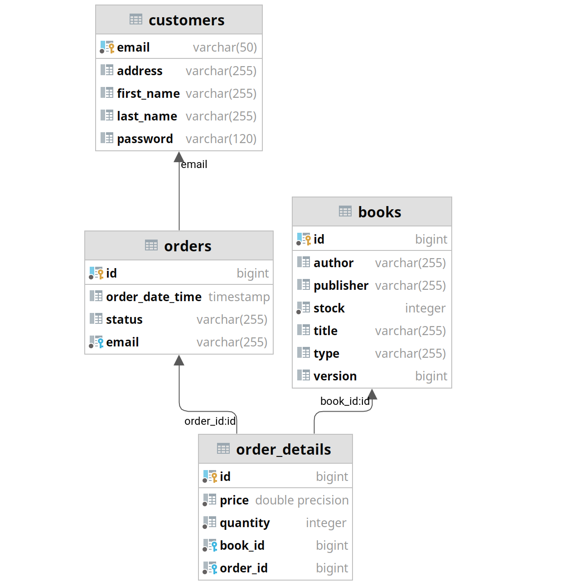

# Reading is good application

**ReadingIsGood** is an online books retail firm which operates only on the Internet. Main
target of ReadingIsGood is to deliver books from its one centralized warehouse to their
customers within the same day. That is why stock **consistency** is the first priority for their
vision operations.

Since consistency is the priority, it's better to go with a relation DB than a NoSQL one. 
In this project, I used Spring Boot as a framework for backend and PostgreSQL as a DB.
I tried to add unit tests and integration tests in the project (Junit).

### DB diagram


## Guidelines
Since this application should be containerized, I used docker for it. 
1. In case you don't have docker please follow this [link](https://docs.docker.com/get-docker/) to install it.

2. clone the repo
```sh
git clone https://github.com/nesrinesghaier/ReadingIsGood.git
```

3. build the project
```maven
mvn clean package -Dmaven.test.skip=true
```
4. run docker-compose-dev file to start the db service alongside the java app or run the docker-compose file to run the whole application 
```
docker-compose -f docker-compose-dev.yml up -d
```

[Link](https://app.getpostman.com/join-team?invite_code=728c3e9a9acc3453c797eff60037aee6&ws=0ddfccd2-fc24-4c62-8c05-3b935d830cad) to postman collection: 
